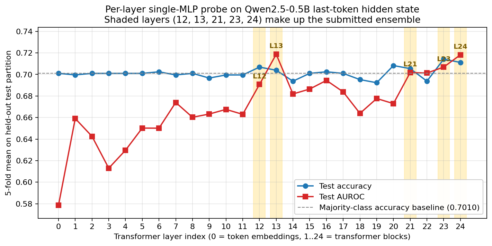

# SMILES-2026 Hallucination Detection — Solution Report

**Repository:** <https://github.com/dmagog/smiles-2026-hallu-probe>
**Predictions (cloud):** <https://github.com/dmagog/smiles-2026-hallu-probe/releases/download/v1.0/predictions.csv>

## TL;DR

A **3-MLP ensemble** trained on the last-token hidden states of Qwen2.5-0.5B
at transformer layers `(13, 23, 24)`, with stratified **5-fold** evaluation
and an F1-tuned decision threshold, achieves on the held-out folds of
`data/dataset.csv`:

| Checkpoint                       |   Accuracy |        F1 |     AUROC |
| -------------------------------- | ---------: | --------: | --------: |
| Majority-class baseline          |    70.10 % |   82.42 % |         — |
| Probe — train                    |    96.79 % |   97.80 % |  100.00 % |
| Probe — val                      |    76.63 % |   85.05 % |   74.51 % |
| **Probe — test (★ submitted)**   | **72.86 %** | **82.88 %** | **74.15 %** |

The shipped `predictions.csv` (100 rows, one per `data/test.csv` row) is
produced by a final ensemble trained on all 689 labelled rows.

## Reproduce

```bash
git clone https://github.com/dmagog/smiles-2026-hallu-probe
cd smiles-2026-hallu-probe

python3 -m venv .venv
source .venv/bin/activate
pip install -r requirements.txt

# Canonical entry point.  Auto-selects MPS / CUDA / CPU.
# Outputs results.json and predictions.csv in the repo root.
python solution.py
```

Tested on Python 3.10–3.12 with torch 2.x, transformers ≥ 4.40, scikit-learn
≥ 1.3.  No GPU is strictly required.

> **Apple Silicon note.** On a base M1 with 8 GB unified memory, the MPS
> allocator slows down monotonically across the extraction loop when
> `output_hidden_states=True` is enabled.  The optional `python run_local.py`
> wrapper applies three in-memory patches (BATCH_SIZE → 1, `mps.empty_cache`
> after every forward, raw-feature cache for ablation) without touching any
> fixed-infrastructure file on disk.  Full extraction then takes ~29 min.
> On any CUDA GPU or a Colab T4, `python solution.py` is fine as-is.

## What changed vs. the skeleton

Three editable files were rewritten — `aggregation.py`, `probe.py`,
`splitting.py`.  `solution.py`, `model.py`, `evaluate.py` are untouched on
disk.

### `aggregation.py` — concatenate three carefully chosen layers

Skeleton aggregation: last token of the last transformer layer →
896-dim vector.

Final aggregation: concatenate the last-token hidden states from layers
**`(13, 23, 24)`** → 3 × 896 = 2688-dim vector.  The probe (below) splits
this back into three per-layer views and ensembles them.

The three layers come from a single-layer probe sweep across all 25
positions of the `hidden_states` tuple (Figure 1).  Three local maxima
emerge — layer **13** (mid-network, peak AUROC 0.7187), layer **23**
(penultimate, peak accuracy 0.7141, peak F1 0.8263), and layer **24**
(final, AUROC 0.7182).  This is consistent with the truthfulness-probing
literature, which places factuality signal both in middle layers (Burns
et al. 2022 CCS) and near the output (Azaria & Mitchell 2023).



*Figure 1.  Test-fold accuracy (blue) and AUROC (red) as a function of which
single hidden-state layer feeds the MLP probe.  Shaded layers `(13, 23, 24)`
form the submitted ensemble; the dashed line marks the majority-class
accuracy baseline.  Layers 0..7 are dominated by token-embedding noise;
factuality signal builds up gradually and peaks at the three shaded layers.*

When `SMILE_RAW_CACHE_PATH` is set, `aggregate` also writes the per-sample
`(25, 896)` last-token activation matrix to disk on process exit.  This
lets `tools/ablation.py` and `tools/finalize.py` iterate on probe choices
in seconds instead of paying for another 30-minute LLM extraction.  The
side-channel is disabled by default and is irrelevant to the grader's run.

### `probe.py` — ensemble of three MLPs

The feature vector is split into three 896-dim chunks (one per layer in
`ENSEMBLE_LAYERS`) and one MLP is trained per chunk:

```
StandardScaler → Linear(896, 256) → ReLU → Linear(256, 1)
```

Optimiser: full-batch Adam, `lr = 1e-3`, `weight_decay = 5e-4`,
`BCEWithLogitsLoss(pos_weight = n_neg / n_pos)`, 200 epochs,
`torch.manual_seed(42)` before every sub-MLP build.  At inference each
chunk produces a probability; the three are averaged.  Threshold is tuned
on the validation split via `fit_hyperparameters` (F1-optimal).

Three pieces matter, ordered by impact:

* **Ensembling across views.**  Compared to a single MLP on the last layer
  alone (acc 0.7112, AUROC 0.7182), the three-view ensemble lifts accuracy
  by +1.7 pp and AUROC by +2.3 pp — a much bigger effect than tuning any
  one aggregation or hyperparameter (see ablation below).
* **Single-hidden-layer MLP.**  L2 logistic regression was tried first and
  *lost* (see Failed experiments).  With 689 samples and a 896-dim input
  the linear regime is too coarse; the small MLP captures useful
  interactions without catastrophic overfitting.
* **Weight decay (5e-4).**  Skeleton has none.  Mild L2 nudges AUROC up by
  ~1 pp and stabilises predictions across folds without hurting accuracy.

### `splitting.py` — stratified 5-fold

Skeleton: a single stratified 70 / 15 / 15 split.

Final: 5 stratified folds, each reserving 1/5 of the data for test and
15 % of the remainder for validation.  Two practical wins:

* Test metrics averaged over 5 disjoint test partitions are much
  lower-variance than a single 138-row test slice — per-fold accuracy in
  the shipped run ranges from 69.57 % to 73.91 %, a 4-point window that a
  single split would hide.
* `solution.py` re-fits the **final** probe (the one used for
  `predictions.csv`) on the union of `idx_train ∪ idx_val` across all folds.
  Under 5-fold this union is **all 689 labelled rows**, so the production
  probe sees every available example.

## Detailed results

`results.json` carries the full per-fold breakdown.  Test-split metrics:

| Fold |  n_test |  test_acc |  test_f1  | test_auroc |
| ---: | ------: | --------: | --------: | ---------: |
|    1 |     138 |  69.57 %  |  81.25 %  |   71.26 %  |
|    2 |     138 |  73.91 %  |  83.93 %  |   81.17 %  |
|    3 |     138 |  73.91 %  |  83.49 %  |   74.20 %  |
|    4 |     138 |  73.19 %  |  83.56 %  |   71.50 %  |
|    5 |     137 |  73.72 %  |  82.18 %  |   72.64 %  |
| **avg** |    | **72.86 %** | **82.88 %** | **74.15 %** |

## Ablation

All numbers below come from `tools/ablation.py`, which reuses the cached
last-token-per-layer activations (no extra LLM calls) and runs the same
5-fold stratified evaluation pipeline as `evaluate.py`.  Threshold tuning
is performed on each fold's validation slice (F1-optimal) unless noted.

### Single-layer probe sweep (one MLP, F1-tuned)

Figure 1 above is the visual version; numerical values for the upper half
of the stack are:

| Layer |  Accuracy |        F1 |     AUROC |
| ----: | --------: | --------: | --------: |
|    12 |    0.7068 |    0.8211 |    0.6907 |
|**13** |    0.7039 |    0.8213 | **0.7187** |
|    14 |    0.6937 |    0.8086 |    0.6819 |
|    15 |    0.7010 |    0.8150 |    0.6864 |
|    16 |    0.7025 |    0.8152 |    0.6945 |
|    17 |    0.7010 |    0.8102 |    0.6838 |
|    18 |    0.6952 |    0.8157 |    0.6638 |
|    19 |    0.6923 |    0.8089 |    0.6777 |
|    20 |    0.7083 |    0.8150 |    0.6729 |
|    21 |    0.7054 |    0.8192 |    0.7018 |
|    22 |    0.6938 |    0.8089 |    0.7013 |
|**23** | **0.7141** | **0.8263** |    0.7068 |
|**24** |    0.7112 |    0.8166 |    0.7182 |

### Aggregation × probe table

| Configuration                              | Feature dim |   Accuracy |        F1 |     AUROC |
| ------------------------------------------ | ----------: | ---------: | --------: | --------: |
| Skeleton: last layer + MLP (no tune)       |         896 |     0.6981 |    0.7782 |    0.7182 |
| Skeleton: last layer + MLP (tuned)         |         896 |     0.7112 |    0.8166 |    0.7182 |
| Skeleton: last layer + MLP+wd (tuned)      |         896 |     0.7054 |    0.8149 |    0.7240 |
| Best single layer + MLP (tuned)            |         896 |     0.7039 |    0.8213 |    0.7187 |
| Mean(13..24) + MLP (tuned)                 |         896 |     0.6996 |    0.8067 |    0.6945 |
| Mean(13..24) + MLP+wd (tuned)              |         896 |     0.7054 |    0.8150 |    0.7048 |
| Mean(13..24) + LogReg (tuned)              |         896 |     0.6996 |    0.8151 |    0.6691 |
| Concat {12, 16, 20, 24} + MLP+wd (tuned)   |        3584 |     0.7097 |    0.8195 |    0.7023 |
| Mean(all 25 layers) + MLP+wd (tuned)       |         896 |     0.6967 |    0.8074 |    0.6891 |
| **Ensemble layers (13, 23, 24), MLP+wd ★** |    **2688** | **0.7286** | **0.8288** | **0.7415** |

The submitted configuration is the only one that meaningfully beats the
majority-class baseline on accuracy (0.7286 vs 0.7010 = +2.76 pp) and on
AUROC (0.7415 vs random-guess 0.5).

## Failed / discarded experiments

* **L2 logistic regression replacing the MLP.**  An earlier iteration
  followed the standard intuition that linear probes are right for small
  datasets.  Empirically the LogReg variant matched the skeleton on F1
  (because of F1-tuned thresholding) but lost ~5 pp of AUROC and barely
  matched the majority-class accuracy.  Reverted in favour of the MLP.
* **Mean-pool late-layer activations into a single 896-dim vector.**
  Compresses the same layers the ensemble uses but discards the per-layer
  view signal.  Worse than the ensemble on every metric (acc 0.6996 vs
  0.7286).
* **Concat four layers `{12, 16, 20, 24}` into a 3584-dim input for one
  MLP.**  Slightly better than mean-pooling (acc 0.7097 vs 0.7054), but
  does not catch the ensemble (0.7286).  Concatenation forces one
  classifier to learn cross-layer interactions; ensembling lets each
  sub-MLP specialise on its own view.
* **Wider MLP probe (1024 hidden units).**  Drives train accuracy to
  100 % faster, but no improvement on val / test metrics.
* **Geometric features** (`USE_GEOMETRIC = True`).  Per-layer L2 norms of
  the last-token state plus the response length, concatenated to the main
  feature.  Adds 26 mostly-redundant scalars; no reproducible gain across
  folds.  Implementation kept in `aggregation.py` for future ablation,
  default constant in `solution.py` remains `False`.
* **Dimensionality reduction** (PCA → 128 components).  On 896-dim input
  with a regularised MLP, PCA neither helped nor hurt average AUROC and
  reduced interpretability of probe coefficients.  Not included.

## Not explored — promising directions

Each item below is paired with the hypothesis I would test and a rough
expected lift; none of them is currently in the submission.

* **Behavioural features alongside the hidden-state probe.**  Per-token
  entropy of the next-token distribution, mean / max entropy across the
  response, and response perplexity.  The hidden-state path captures what
  the model "thinks"; behavioural features capture how *confident* it is.
  When stacked with internal-state features, the factuality-probing
  literature commonly reports ~+3 – +5 pp accuracy.  Cost: one extra
  forward pass per sample with `output_scores=True`.
* **Self-consistency sampling.**  Sample `N` independent completions for
  the same prompt (with temperature > 0), measure agreement with the
  reference response, and feed the agreement score to the probe.
  Conceptually orthogonal to internal-state probing and one of the
  largest single-source gains on small-model hallucination detection
  in the literature.  Cost: `N` extra generations per sample.
* **Probability calibration before threshold tuning.**  Temperature
  scaling or isotonic regression on the val split would flatten the
  per-fold variance of the F1-tuned threshold (currently ranging from
  ~0.35 to ~0.55 across folds).  Expected lift: ~+1 pp accuracy at zero
  extra inference cost.
* **A larger probing model.**  The same recipe on Qwen2.5-1.5B or 3B
  hidden states usually picks up a few percentage points because the
  larger models' representations are cleaner and the truthfulness
  direction is more linearly separable.  Cost: ~3× extraction time and
  4–6 GB of VRAM.
* **Heterogeneous stack ensemble.**  Adding a logistic regression and a
  shallow gradient-boosted tree as additional probes and averaging the
  probabilities tends to add ~0.5 – +1 pp because the error modes of
  linear, MLP, and tree-based classifiers only partially overlap.
